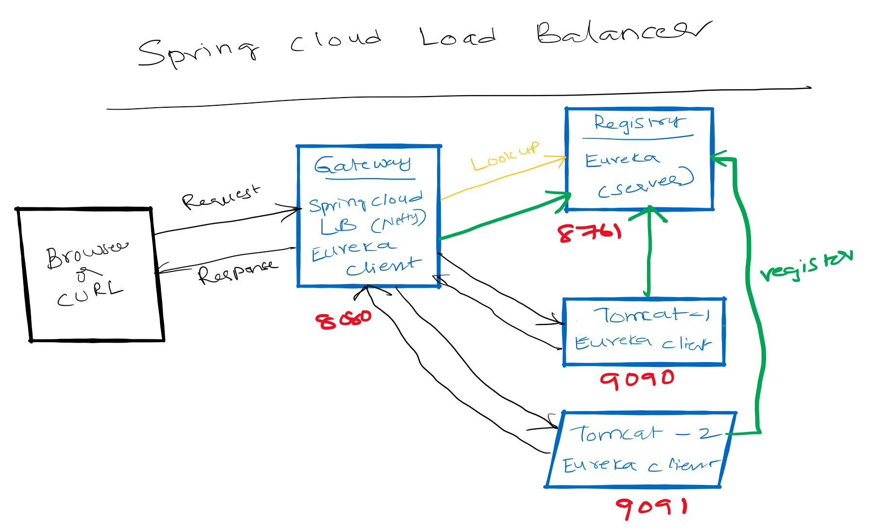

# Spring Cloud LoadBalancer
In this tutorial we are going to learn how to use Spring Cloud Load Balancer for client side load balancing instead of Netflix ribbon . 
As we are aware Netflix ribbon component is under maintainence mode we need to migrate to Spring Cloud Loadbalaner.

Requests from clients are received to Spring Cloud Gateway Component running on port 8080 , Spring Cloud Load Balancer component based on the routes 
mentioned it forwards the requests to rest api servers. Spring Cloud Load Balancer is going to fetch restapi instances information from Eureka Registry.
Every application (Gateway,restapi) registers it availability with Eureak registry.

- Steps
    - Gateway (Netty) runs on port 8080
    - Requests on 8080 are reverse proxied (forwarded) to  rest api running on 9090 and 9091
    - Eureka Registry Server is running on port 8761
    - When Gateways starts up on port 8080 registers with Eureka Server
    - When rest api servers starts on 9090 and 9091 registers with Eureka Server
    - Spring Cloud gateway uses Spring Cloud Load Balancer and routes all the requests that are coming on 8080 in a round robin fashion to 9090 and 9091
    - When are new rest api instance starts on 9092 it registers with Eureka and routing is dynamically enabled by Gateway 
    - New application servers can be dynamically added
    - Application servers (service urls) are maintained in Registry
    - Netflix Eureka component plays a role of registry
    - Spring Cloud Load Balancer plays a role of Client side load balancer
    - Netflix Eureka Client is included in all the application servers (services)  and Gateway
# Source Code 
    git clone https://github.com/balajich/reverse-proxy-spring-cloud-loadbalancer.git
# Video

# Architecture

# Prerequisite
- JDK 1.8 or above
- Apache Maven 3.6.3 or above
# Clean and Build
    mvn clean install
# Running components
- Registry: java -jar .\registry\target\registry-0.0.1-SNAPSHOT.jar
- Gateway:  java -jar .\gateway\target\gateway-0.0.1-SNAPSHOT.jar
- Rest API instance 1: java -jar .\restapi\target\restapi-0.0.1-SNAPSHOT.jar
- Rest API instance 2:  java -jar '-Dserver.port=9091' .\restapi\target\restapi-0.0.1-SNAPSHOT.jar
# Using curl to test environment
- Access rest api via gateway:  curl http://localhost:8080/
- Access rest api directly on instance1 : curl http://localhost:9090/
- Access rest api directly on instance2 : curl http://localhost:9090/
# Hints
-  If you are using Netflix ribbon for client side loading balancing set the property ** spring.cloud.loadbalancer.ribbon.enabled=false** than Spring Cloud Load Balancer will be used as ribbon automatically
- Note only netflix ribbon is in maintainence mode , Please continue to use Eureka as registry
